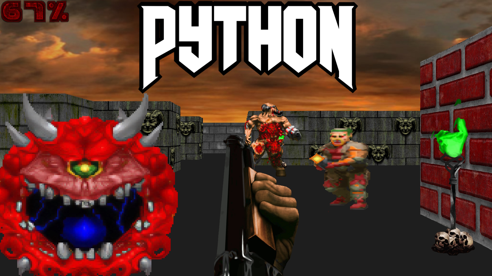
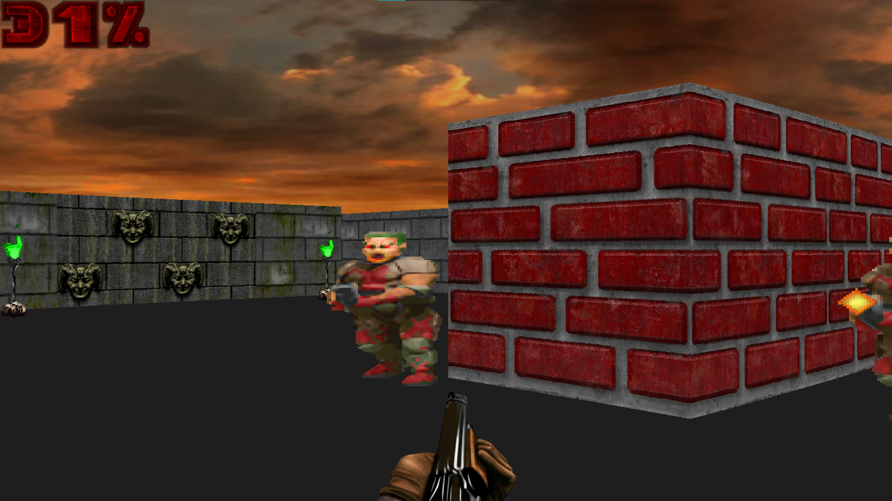
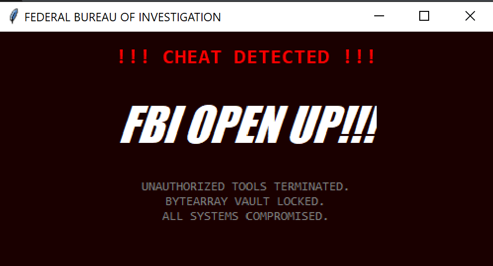

# 🔫 WolfDoom3D (WD3D) | Raycasting Hybrid Rendering 3D Game

**WolfDoom3D** is a high-performance 3D engine built entirely from the ground up in Python. It serves as a technical demonstration of how high-level languages can achieve near-native performance through hardware acceleration, binary compilation, and optimized memory management.

---

## 🏗️ Technical Architecture Deep Dive

### 1. The Rendering Pipeline: Hybrid DDA & GPU Blitting

Unlike standard Python implementations, WD3D uses a highly optimized **Digital Differential Analyzer (DDA)** algorithm for spatial projection.
blitting. Texture data is held in VRAM-accessible buffers, minimizing the CPU-to-GPU data transfer overhead.

- **Visual Logic Enhancements:**
  - **Per-Column Texture Manipulation:** Dynamic slicing of textures based on ray-hit offsets (X-hor/Y-vert).
  - **Fake Ambient Occlusion (AO):** Static darkening of vertical wall segments by a 0.75x factor to simulate directional lighting and emphasize corner depth.
  - **Dynamic Fog Falloff:** Implements an exponential distance-shading formula: `color = 255 / (1 + depth^2 * 0.0001)`, creating a dark, atmospheric horror aesthetic.

### 2. DoomGuard™:

DoomGuard: Your worst nightmare.
WD3D doesn't just play; it fights back. Our custom security layer makes sure that demons are the only ones you'll be killing.
The Moving Target: Your stats change their location in RAM every single frame. Good luck finding them, cheater.
The Sentinel: Active monitoring of your OS. If we see a debugger, you see the Red Screen of Death.
No Guard, No Game: If the .pyd is missing, the game won't even say hello.

### 3. Kinetic Feedback & Chronos Management

WD3D features a sophisticated time-management system to enhance player immersion.

- **Bullet Time (Matrix Mode):** Implemented via a global `time_scale` multiplier. Upon taking damage, the engine scales all `delta_time` calculations down to 10%-15% of normal speed, allowing for cinematic 160 FPS slow-motion while maintaining full control responsiveness.
- **Heavy Stun Mechanics:** Utilizing a decay-based intensity algorithm, damage events trigger a camera shake that physically offsets the entire rendering pipeline. It also induces a "stun-drift" in mouse polling, forcing players to fight against the disorientation.

---

### 4. Built With

This project is powered by the following libraries and technologies:

- **[pygame-ce](https://pygam-ce.org)** – The core game engine (Community Edition for superior performance and features).
- \*\*[pygame-ce-pypi](https://pypi.org/project/pygame-ce/)
- \*\*[pygame-ce-website](https://pyga.me/)
- \*\*[pygame-ce-img](pygame-ce.png)
- **Tkinter** – Handling system-level dialogs and emergency alert windows.
- **threading** – Powering the **DoomGuard** sentinel in a dedicated background thread for 24/7 monitoring.
- **math** – Advanced 3D raycasting, trigonometry, and complex engine calculations.
- **os & sys** – Low-level system operations, file integrity checks, and immediate process termination.

---

## 🚦 Performance Benchmarks

- **RAM Footprint (Error State):** ~10MB (Sterile security layer).
- **RAM Footprint (Active Game):** ~150-200MB (GPU-Accelerated texture buffers).

---

## 📜 Credits & Inspiration

- Original engine base inspired by **[Coder Space](https://www.youtube.com/watch?v=ECqUrT7IdqQ)**.
- Original source by StanislavPetrovV: [GitHub Link](https://github.com/StanislavPetrovV/DOOM-style-Game)
- **Note:** This version is heavily modified and licensed under **GNU GPL v3**.
- _The doomguard.pyd module is a proprietary binary component and is not covered by the GPL v3 source license._

---

## 🔧 Build & Development Info

### Compilation Command for main:

pip install nuitka
cd X:\your_file_path.py\DOOM-style-Game-main
nuitka --standalone --lto=yes --windows-console-mode=disable main.py

### Compilation Command for PY Modules:

cd X:\your_file_path.py\DOOM-style-Game-main
nuitka --module --lto=yes map.py
nuitka --module --lto=yes npc.py
nuitka --module --lto=yes object_handler.py
nuitka --module --lto=yes object_renderer.py
nuitka --module --lto=yes pathfinding.py
nuitka --module --lto=yes player.py
nuitka --module --lto=yes raycasting.py
nuitka --module --lto=yes settings.py
nuitka --module --lto=yes sound.py
nuitka --module --lto=yes sprite_object.py
nuitka --module --lto=yes weapon.py

### Good luck, soldier!
